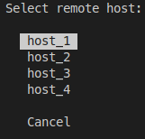

# ssh-selector
Interactive selection menu for all configured ssh hosts

# Usage
By default `sshs` will read a properly formatted ssh config file (https://linux.die.net/man/5/ssh_config) that is located at `$HOME/.ssh/config`. The config directory can be changed by modifying the `$SSH_CONFIG_PATH` environment variable to be the location of this path.

`sshs` will show all hosts defined by their name in the `Host [name]` line of config. Select the desired host using the arrow keys and press enter to connect to that host. Note incorrect config files are not handled and only a simple parse of the `Host [name]` line is run and passed directly to `ssh`. Select `Cancel` to easily close the selector.
